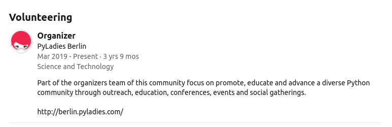

# Supporting PyLadies

PyLadies is completely ran by volunteers, we all have our own reasons for choosing to donate our free time to the community and we all do so in different ways. We welcome your support and will do our best to support you.

**Page Contents**

- [What you can expect](#what-you-can-expect)
- [Ways you can get involved](#ways-you-can-get-involved)
- [Recognizing your work, what we can offer](#recognizing-your-work-what-we-can-offer)

## What you can expect

Supporting can range from one off events, regular or a series of events, handling our social media or email, donating money or resources, or something else which you believe will benefit our community. As you will do this in your free time we always recommend to think about what is sustainable for your situation, and something you will feel is beneficial to you. For example giving a workshop might help you develop your public speaking skills while facilitating one might help develop managerial or team building skills. As a member of our community you are empowered to lead it and advocate for the things you feel are important. This work can be exciting and rewarding, it will not only help you build up skills, build a network within the broader Python community but also have a huge impact on many other community members. We recognize that many of you have other commitments and may have to drop out for a while or entirely if your situation changes.

### Testimonials

*"I love contributing to the community. I consider myself a self taught/ community taught developer and I am thankful to those who supported me on my journey transitioning into tech. I spend around 4-5 hours a week doing various tasks including talking to other community members, answering emails, checking and posting on our social media platforms, facilitating events as well as creating content. I mentor other community members who wish to get involved and speak to folks who are making similar transitions to myself to give them some insight and encouragement. I joined the org team in 2018 when I was transitioning into tech, though I had no technical skills at that point I could support with setting up events. I have taken a couple of breaks from being an organizer when I needed to put my focus elsewhere, but find myself returning due to the reasons above and because of the many friends I have made. I couldn't imagine not being involved in some capacity."*
***- Jessica Greene***

*"As a student, it was really nice to be completely embraced and equally valued by other ladies, joining and organizing PyLadies events also gave me an opportunity to meet people working with Python and learning about the tools being used in the industry."* 
***- F***

*"I love being part of the PyLadies community because I love connecting with like minded people, supporting each other, and working together towards PyLadies’ mission."*
***- M***

*"For a long time I felt like I did not belong in tech. On the way, I met many people who felt as I did. This motivated me to try my best to make others feel included in the PyLadies community. Through building a community, I have found my way to belong as well."*
***- L***

*"It is because of this group, in chapters in Rio de Janeiro, Mexico City and especially Berlin, that I was able to change careers and meet my closest care network. Especially in Berlin, a city with more than 30% foreigners far from their family network, PyLadies makes a bit of a difference in life."*
***- P***

*"I met some of the most supportive and inspiring organizers at PyLadies. It’s a great place to share knowledge and learn. To get motivated, and inspired, and pass on sponsorship opportunities as you get ahead in you career - pay it forward. I can’t think of a better network with worthier more hardworking, giving and sincere folks. I truly cherish these connections and experiences. So grateful."*
***- N***

## Ways you can get involved

As we mentioned there are many ways to get involved. Some of the most common ways include:

- [giving a talk or workshop](./giving_a_workshop_or_talk.md)
- [facilitating an event](./facilitating_events.md)
- [being a coach or mentor](./coaching.md)
- [helping other on slack](./coaching.md#support-others-on-slack)
- [managing our social media platforms](./social_media.md)
- [managing our emails](./accounts.md#email-account-management)

### Other ways you might support the community

However perhaps you see an opportunity we have not yet identified, we welcome ideas and suggestions. If you want to discuss them more we suggest attending our [monthly org meeting](#monthly-org-meetings) which takes place on the last Thursday of the month, we post reminders including details on how you can join in our slack.

## Recognizing your work, what we can offer

While we normally can't financially compensate folks for their work we still think it's important to recognize those who make our community so awesome :sparkle: we therefore have a couple ways that we can highlight your work:

- Add your volunteer work on your CV, we think it's pretty awesome that your supporting the community and so do employers! Incase you need a reference you can email us at [berlin@pyladies.com](mailto:berlin@pyladies.com) and we will do our best to write one from our official account.
- Add your volunteer work on LinkedIn, you can add your volunteer work to PyLadies Berlin on your profile and let potential employers know that you are supporting the community. 

*example of LinkedIn accreditation*

- *coming soon* Add yourself to our website, we aim to make it easy to open a PR and add yourself as a contributor on our website. As soon as this is possible we will post information here.
- *coming soon* Let us shout about you! We would love to make some noise about how you are supporting our community, we will collect some basic information so we can post on our social media platforms and show our appreciation.
- *coming soon* We are currently waiting on PyLadies Berlin T-Shirts and from time to time receive other swag which we receive for those who contribute to our community, what more of an incentive do you need ;)

## Monthly Org Meetings

We run monthly organizer meetups on the last Thursday of the month between 7pm-8pm (Berlin time) you have both the option to join in person or remotely. If you want to know how we plan events/ make decisions in the community either as purely an observer or more actively then you are welcome to join us :heart:

Sometimes we will also try offer the main session trainings or facilitated discussion sessions that might interest community members involved in organization :slightly_smiling_face:

If you want to be added to the calendar invite email us at [berlin@pyladies.com](berlin@pladies.com) with the subject: `Pyladies org meetings`. We also post reminders including details on how you can join in our slack.

Agenda points are set [here](https://www.google.com/url?q=https://docs.google.com/document/d/11kaYPgLb4HXavPUbgTTngdGLXZjNMjW-LNnA4FkguYY/edit?usp%3Dsharing&sa=D&source=calendar&usd=2&usg=AOvVaw2nxnPeDc7vquLAu5sG459c) (ask in slack or email us if you cannot access it).

We have three sections:
- **Announcement:** short announcements that require no input or a thumbs up thumbs down from the group
- **Request for help:** 5 minute slot to make your proposal and ask for help (including questions posed to you)
- **Discussion topics:** Longer topics which require more input & open discussion

Each section has a time limit, then within each section we run a [coffee style facilitation](https://www.scrum.org/resources/blog/lean-coffee-5-minutes): 3 minutes are put on the clock, after 3 minutes we can move on to the next or keep going for 3 more minutes. Topics not reached will move to the top for the next meeting.

Please be respectful and thoughtful, this is a space for all to participate and give their input. If you have spoken on a number of topics, give space on the next for other folks. Please stick to the current topic.

We rotate facilitation of this meeting and if you are interesting in running the facilitation let us know via email.

## Ready for more?

[> back to the starting point](../start_here.md)
[> other ways to support the community](./supporting_pyladies.md#other-ways-you-might-support-the-community)
[> hosting PyLadies Berlin](./hosting_and_sponsorship.md#hosting-pyladies)
