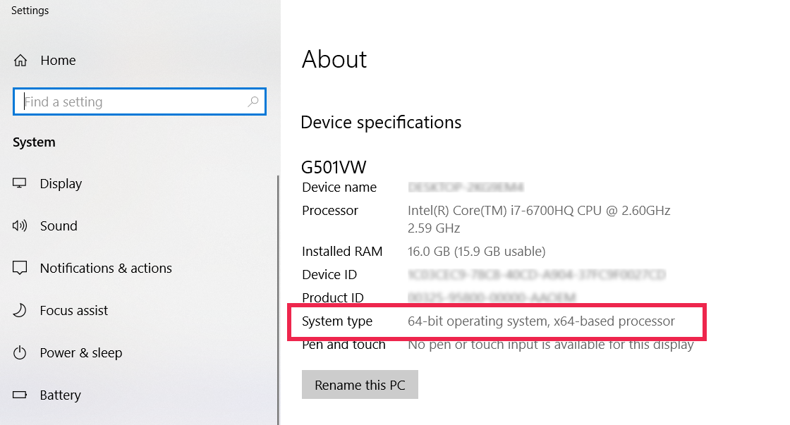

# Shall I choose 32-Bit or 64-Bit installer?

In general, if your operating system has a 32-Bit architecture, choose a 32-Bit installer. If it has a 64-Bit architecture, choose a 64-Bit one. 

To find out the architecture of your OS 

* [macOS](#macOS)
* [Ubuntu](#ubuntu)
* [Windows](#windows)

## macOS

Note: Mac OS X 10.6 Snow Leopard is the last release that a 32-bit Intel Mac can run, Mac OS X 10.7 Lion and up are, by default, 64-bit.

Launch "System Information"[^1] and click on the Software heading in the Contents section. The line 64-bit Kernel and Extensions will say Yes if you are running the 64-bit kernel and No if you are running the 32-bit kernel[1](#StackExchange:2017).

## Ubuntu

Press your Meta key (most likely it is your "Windows" key), type "about", and select "About" in "Settings". 

## Windows

Press "Windows" key, type "about" and select "About your PC". 

[^1]: or "System Profiler" on Mac OS X 10.6 Snow Leopard

## References
[1]: [How to check whether my Intel-based Mac is 32-bit or 64-bit
 on StackExchange.com](https://apple.stackexchange.com/questions/12666/how-to-check-whether-my-intel-based-mac-is-32-bit-or-64-bit)
