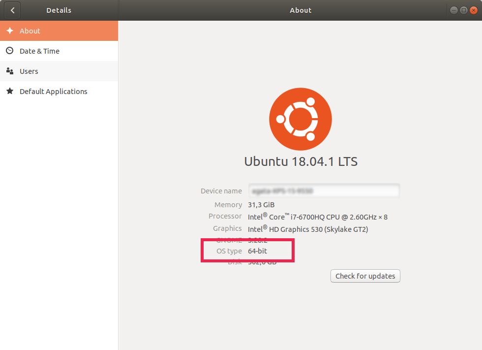

# Shall I choose 32-Bit or 64-Bit installer?

* [macOS](#macOS)
* [Ubuntu](#ubuntu)
* [Windows](#windows)

## macOS

macOS is fairly bitness-agnostic, so either version should work.

## Ubuntu

## Windows

Press "Start" button, type "about" and select "About your PC". 

